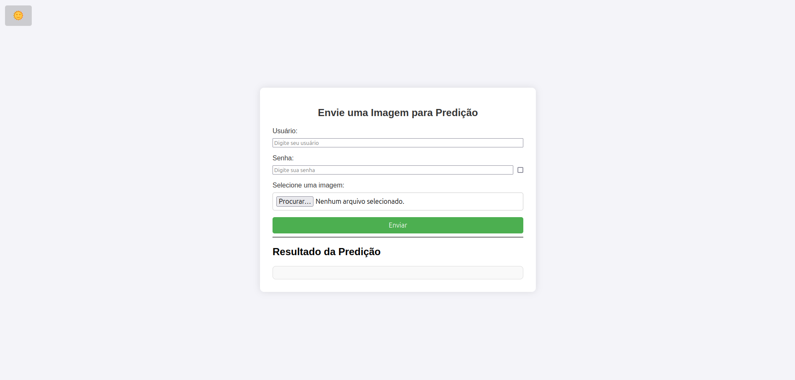

# Machine Learning Developer
[GitHub](https://github.com/maryane-castro).
[Linkedin](https://www.linkedin.com/in/maryanecastro/).
[Email](mailto:maryanecastrodev@gmail.com)

#### Technical Skills: Python, SQL, AWS, pytorch, tensorflow and everything I dedicate myself to.

## Education
- B.S., Mechatronics Engineering | Federal Institute of Education, Science, and Technology of Ceará (_Expected 2027_)	

- Computing, Systems Analysis | Universidade de Fortaleza – UNIFOR (_January 2025_)

- Technical Degree, Information Technology | Federal Institute of Education, Science, and Technology of Ceará (_December 2023_)

## Work Experience

**Back-end Developer (Federal Employee) @ Federal University of Ceará (UFC), Brazil (_July 2025 – Present_)**

- Act as a Back-end Developer in the Brazilian federal public sector at the Universidade Federal do Ceará (UFC), developing and maintaining institutional systems with a focus on Java.
- Design and implement RESTful APIs, business rules, and integrations with relational databases, ensuring security, scalability, and code quality.
- Work with data engineering and analytics pipelines, supporting institutional decision-making through structured data processing.
- Integrate Artificial Intelligence and Machine Learning solutions into backend systems, including the use of LLMs, data-driven models, and automation services.
- Contribute to MLOps practices, model integration, and system reliability in production environments.

**MLOps Developer @ Domy (_April 2025 – July 2025_)**

- Worked remotely as an MLOps Developer, collaborating on the end-to-end lifecycle of Machine Learning models and Generative AI systems.
- Built, trained, and deployed machine learning models and generative AI solutions, integrating them with backend services.
- Designed and maintained ML pipelines, model versioning, and deployment workflows, ensuring reproducibility and reliability.
- Integrated models into production environments using Docker, cloud services, and backend APIs, bridging data, ML, and application layers.
- Collaborated closely with backend engineers to ensure scalable, secure, and maintainable AI-driven systems.

**Machine Learning Developer @ NUVEN (_May 2023 - April 2025_)**
- Developed an automated image detection and analysis system using Python, YOLO for real-time detection, and OpenCV, reducing processing time by 80%. The system, previously manual, now generates over 300 reports per day compared to only 3 before.
- Created an AI system adaptable to user preferences, integrating personalized recommendations with TensorFlow, Keras, and Llama, increasing customer retention and loyalty by 40%. Structured MLOps pipelines for model training and deployment, utilizing Kubernetes, Docker, and Apache Spark to ensure scalability and automation.
- Developed advanced computer vision and machine learning solutions, optimizing data pipelines with Apache Spark, Pandas, and Docker for real-time processing, resulting in greater operational efficiency. Used Kubernetes for container orchestration to ensure scalability and flexibility.
- Created custom datasets and developed AI models, language models (LLMs), and Retrieval-Augmented Generation (RAG) models using Hugging Face, PyTorch, and SAM (Segment Anything Model) to optimize specific solutions and improve the performance of applications and systems.

**Software/Machine Learning Engineer @ IFCE (_January 2023 - December 2023_)**
- Developed a digital platform for integration and automation of administrative processes between laboratories using Spring Boot, Python, Flask, and PostgreSQL, increasing document processing speed and internal organization by 50%.
- Implemented technologies such as React, Redux, and Docker to create intuitive interfaces and faster, more reliable data pipelines.
- The new solution reduced operational errors by 30% and allowed for the centralization of previously dispersed information, speeding up collaboration between academic and technical teams.

**Software Developer @ IFCE (_January 2022 - December 2022_)**
- Developed an application for managing food services at the institution, improving user control efficiency by nearly 90% using Java, Spring Boot, and Firebase, eliminating over R$ 70,000 in annual waste per institution.
- Created a solution to automate student attendance tracking using QR Code, AWS Cloud, and Kubernetes, which generated detailed annual reports on school dropout rates. This innovation contributed to retention strategies, reducing abandonment rates by 25%.
- Developed a real-time monitoring system for meals and resources, integrating data with financial and administrative systems using MySQL, Node.js, and Docker, improving management efficiency.

## Pet Projects
### Spider-Robot  
[Repository](https://github.com/maryane-castro/Spider-Robot)  
Designed and developed a **Bluetooth-controlled quadruped robot** using **C++** and Arduino. The robot utilizes servo motors for locomotion and communicates via Bluetooth for remote control. Implemented motion strategies such as forward/backward movement, turns, and custom actions like waving.  
This project showcases expertise in **embedded systems, robotics, and real-time control**, leveraging **Arduino's Servo and SoftwareSerial libraries** to manage servo coordination and Bluetooth communication.  

### Tequila: Image Prediction API with YOLOv5  
[Repository](https://github.com/maryane-castro/tequila)  

Developed an **image classification API** using **YOLOv5** and **Flask** to detect whether an image belongs to the "open" or "closed" class. The API processes images and returns predictions with confidence scores.  

This project integrates **machine learning, deep learning, and cloud deployment** by utilizing **Docker** for containerization and **Azure** for hosting. It also includes a **load testing suite with Locust** to evaluate API performance under different loads.  

- **YOLOv5-based image classification**  
- **REST API built with Flask**  
- **Load testing with Locust**  
- **Dockerized deployment on Azure**  

### Image Prediction API with YOLOv5  
[Repository](https://github.com/maryane-castro/sale)  

Developed an **image classification API** using **Flask** to detect offers in images, leveraging **OCR** and **NLP** techniques. The API processes images and returns predictions with confidence scores for different categories, such as offers and prices.  

This project integrates **machine learning, computer vision, and cloud deployment** by utilizing **Docker** for containerization and **Azure** for hosting. It also includes a **load testing suite with Robot Framework** to evaluate API performance under different loads.  

- **OCR-based offer detection**  
- **REST API built with Flask**  
- **Dockerized deployment on AWS**  

### EducaMEET  
[Repository](https://github.com/maryane-castro/educaMEET)  
EducaMEET is an **online platform** designed to connect educators and students in managing academic events such as lectures, workshops, and extension activities. The platform enables higher education institutions to **promote and efficiently manage events**, making participation more accessible and interactive.  

Students can **search for events, confirm attendance, track their participation history, and obtain certificates**. Additionally, the **event evaluation feature** allows organizers to continuously enhance the participant experience.  

This project showcases expertise in **web development, database management, and user experience**, leveraging modern technologies to build a robust and intuitive solution.  

  

  

Check out more of my projects on [GitHub](https://github.com/maryane-castro).

## Youtube
- [Machine Learning YouTube](https://youtube.com/@maryanecastrodev?si=epOVWQo6qU5mJ78c)

## Publications

1. **Generating Personalized Feedback from Professional Profile Tests Using RAG: A Case Study with MAPER**  
   *Sociedade Brasileira de Inteligência Artificial (SBIA)*, October 31, 2025.  
   **DOI:** 10.21528/CBIC2025-1132688  
   **Authors:** Erik Jhones Freitas do Nascimento; Jessyca A. Bessa; **Maryane C. Lima**; Igor Rafael Silva Valente; Saulo M. Maia; Maria Lúcia Rodrigues Corrêa.

2. **LLaMA for Sentiment Analysis in Self-Care Applications: A Case Study with Life Energy**  
   *Sociedade Brasileira de Inteligência Artificial (SBIA)*, October 31, 2025.  
   **DOI:** 10.21528/CBIC2025-1134393  
   **Authors:** Inácio L. Souza Filho; **Maryane de Castro Lima**; Anderson I. M. Ripardo; Jessyca A. Bessa; Wedja J. G. Costa; Jermana Lopes de Moraes.

3. **Language Model Architectures for Behavioral Assessment: A Case Study on MAPER**  
   *Intelligent Systems – BRACIS 2025*, First Online: February 8, 2026, pp. 336–348.  
   **DOI:**
   **Authors:** Erik J. F. Nascimento; Jessyca A. Bessa; **Maryane C. Lima**; Igor R. S. Valente; Saulo M. Maia; Maria L. R. Corrêa.

4. **STEMulheres: Empoderando a Participação Feminina nas Ciências e Tecnologias**  
   *Revista Contemporânea*, April 8, 2025.  
   **DOI:**
   **Authors:** R. D. Moura; J. A. Bessa; A. L. A. Nunes; **M. de Castro Lima**.

5. **STEMulheres: Empoderando a Participação Feminina nas Ciências e Tecnologias**  
   *Anais do Computer on the Beach*, vol. 15, pp. 378–383, 2024.  
   **DOI:**
   **Authors:** R. D. Moura; J. A. Bessa; A. L. A. Nunes; **M. de Castro Lima**.

6. **Vamos Merendar? Um Aplicativo para Mitigar Desperdício de Merenda Escolar nas Escolas Públicas de Maranguape**  
   *Anais do XIV Congresso Norte Nordeste de Pesquisa e Inovação (CONNEPI)*, December 8, 2024.  
   **DOI:**
   **Authors:** Hosana Clara de Brito Soares Bezerra; **Maryane de Castro Lima**; Thomaz Maia de Almeida; Jessyca Almeida Bessa.

## Blog
- [My first blog](https://maryane-castro.github.io/blog/)